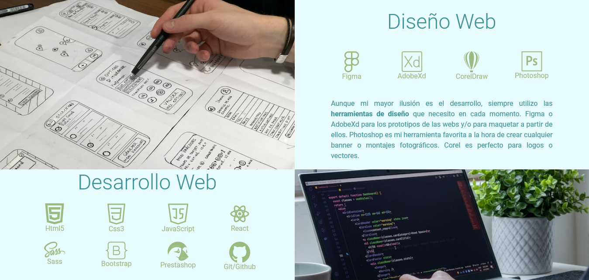
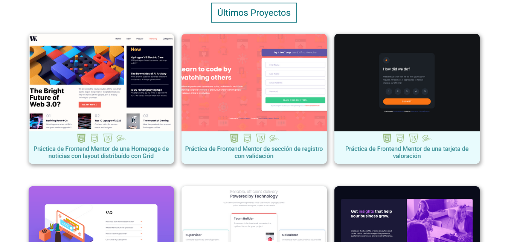

# Portfolio

## Tabla de Contenido

- [Introducción](#introduccion)
  - [Capturas de Pantalla](#capturas-de-pantalla)
  - [Links](#links)
- [Tecnologías](#tecnologías)
- [Autor](#autor)

## Introduccion

Portfolio creado con Html, Scss y Javascript conteniendo los conocimientos, los últimos proyectos que irán apareciendo con un efecto de fade conforme scroleamos y que se cargarán por bloques de 12 mediante un botón de cagar más proyectos. Termina con un formulario de contacto que validará que tenga contenido y el email enviado esté en un formato correcto. Totalmente responsive.

### Capturas de pantalla

#### Cabecera

#### Conocimientos

#### Proyectos

#### Contacto

### Links

- Código URL: [Solución](https://github.com/jcarloscab/jcarloscab.github.io)
- Web URL: [Site](https://jcarloscab.github.io)

## Tecnologías

- Grid
- Flexbox
- BEM
- SASS/SCSS

## Autor

- Frontend Mentor - [@jcarloscab](https://www.frontendmentor.io/profile/jcarloscab)
- GitHub - [@jcarloscab](https://github.com/jcarloscab)
